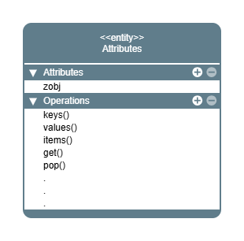

.. _Attributes class:

rockverse.Attributes
====================

.. currentmodule:: rockverse

.. autoclass:: Attributes

.. image:: class_Attributes_light.png
  :alt: RockVerse logo for white background
  :class: only-light,
  :align: center

Attributes
----------

.. autosummary::
    :toctree: _autogen

    ~Attributes.zobj

Methods
-------

.. autosummary::
    :toctree: _autogen

    ~Attributes.__getitem__
    ~Attributes.__setitem__
    ~Attributes.__iter__
    ~Attributes.__contains__
    ~Attributes.__len__
    ~Attributes.__repr__
    ~Attributes.__str__
    ~Attributes.asdict
    ~Attributes.keys
    ~Attributes.values
    ~Attributes.items
    ~Attributes.get
    ~Attributes.pop
    ~Attributes.clear
    ~Attributes.update
