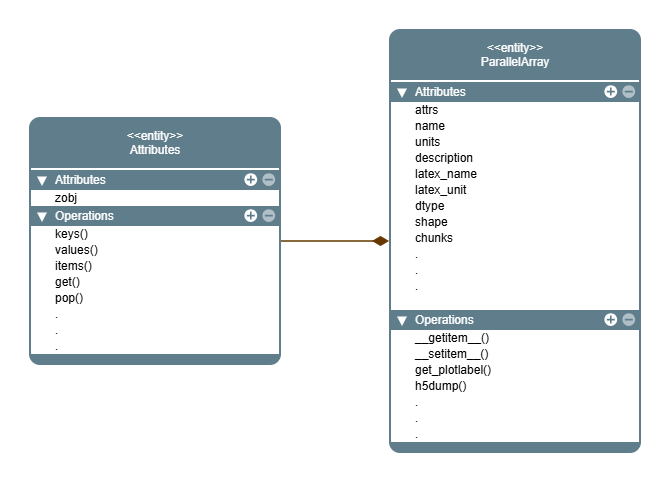

.. _ParallelArray class:

rockverse.ParallelArray
=======================

.. currentmodule:: rockverse

.. autoclass:: ParallelArray

.. image:: class_ParallelArray_light.png
  :alt: RockVerse logo for white background
  :class: only-light,
  :align: center

Attributes
----------

.. autosummary::
    :toctree: _autogen

    ~ParallelArray.zarray
    ~ParallelArray.chunk_process_map
    ~ParallelArray.attrs
    ~ParallelArray.name
    ~ParallelArray.unit
    ~ParallelArray.latex_name
    ~ParallelArray.latex_unit
    ~ParallelArray.description
    ~ParallelArray.dtype
    ~ParallelArray.shape
    ~ParallelArray.chunks
    ~ParallelArray.nchunks

Methods
-------

.. autosummary::
    :toctree: _autogen

    ~ParallelArray.__getitem__
    ~ParallelArray.__setitem__
    ~ParallelArray.chunk_slice_index
    ~ParallelArray.clean_chunks
    ~ParallelArray.h5_dump
    ~ParallelArray.get_plot_label

Related tutorials
-----------------

.. nblinkgallery::

   ../../tutorials/data/basedata/parallelarray
