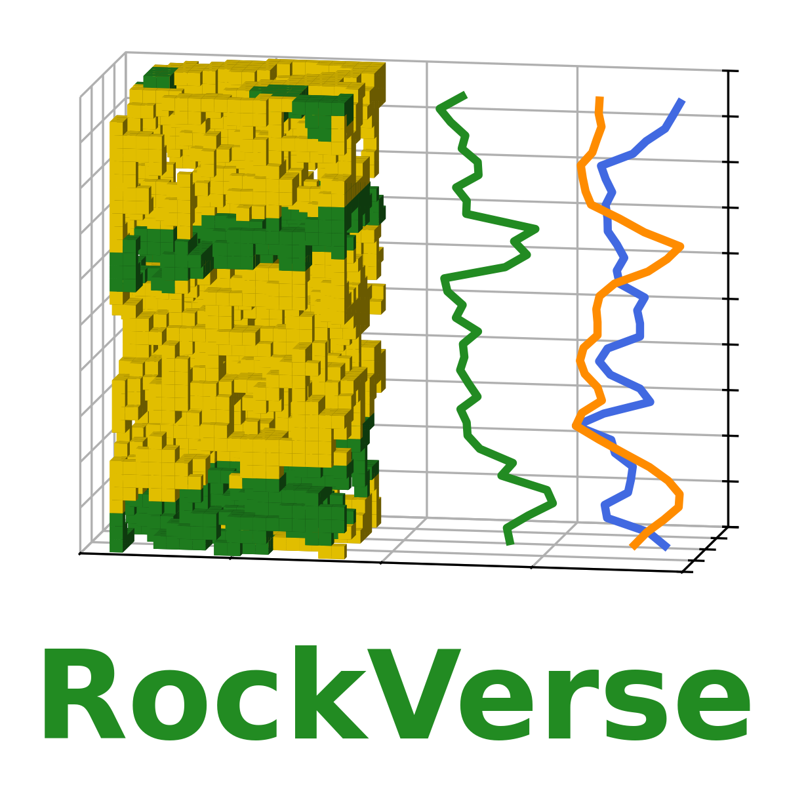
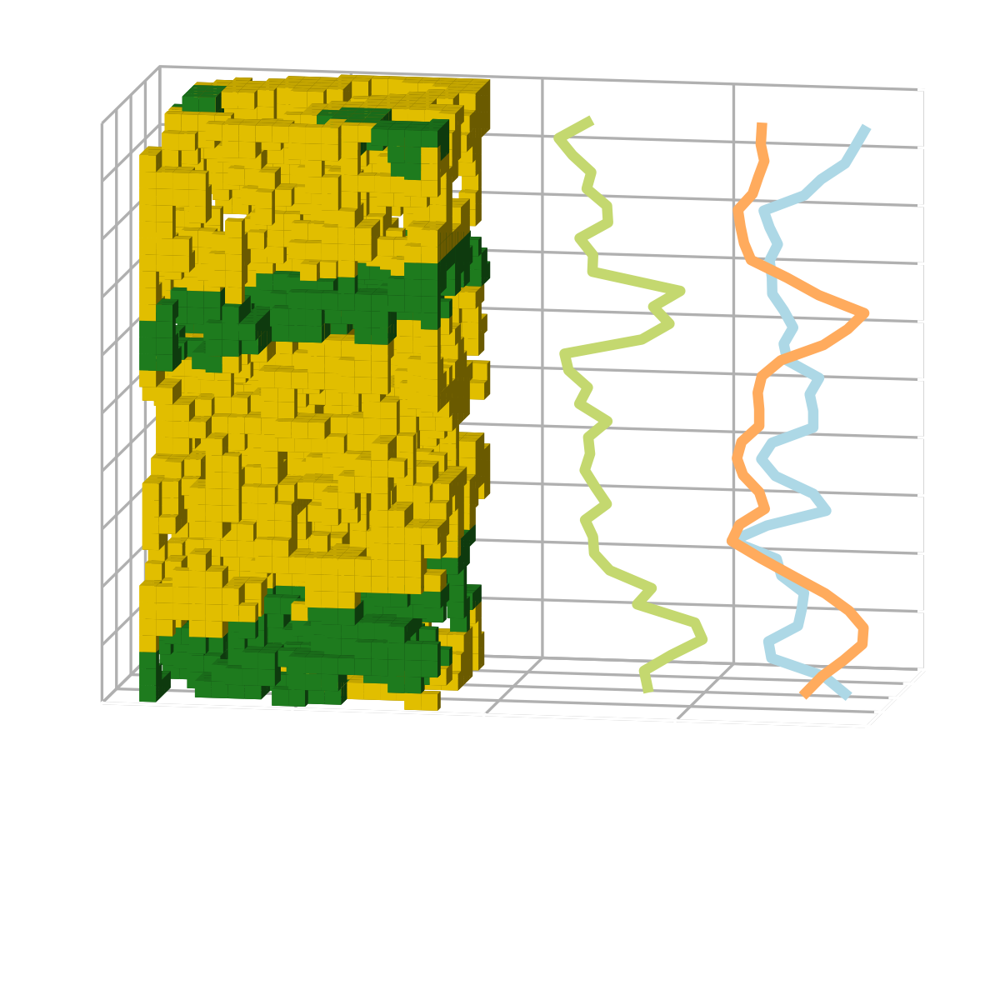

.. _rockverse_docs_mainpage:

:html_theme.sidebar_secondary.remove:

.. title:: RockVerse Documentation | Python Tools for Computational Petrophysics

.. rst-class:: h2 text-center font-weight-light my-4

  Python tools for Computational Petrophysics

.. rst-class:: h5 text-center font-weight-light my-4

  Version |version|

**RockVerse** is an open-source Python library designed to support high-performance
computational petrophysics workflows. It is tailored for researchers and
professionals working in **digital rock petrophysics**, **formation evaluation**,
**well logging**, and **laboratory data analysis**.

Built to handle large-scale simulations and memory-intensive data processing,
RockVerse leverages state-of-the-art tools to deliver optimized performance
across CPU and GPU parallel computational environments.

This library is part of an ongoing post-doctoral research project under active
development. We welcome contributions, bug reports, and feature suggestions.
Check back regularly for updates, tutorials, and new features.
If you want to stay informed, consider :ref:`joining our mailing list <rockverse_docs_maillist>`.

.. rst-class:: h1 text-center font-weight-light my-4

  Key Features

.. dropdown:: High-Performance Parallel Computing
  :animate: fade-in

  Optimized for **HPC environments**, RockVerse enables scalable, distributed parallel
  processing through **MPI** (Message Passing Interface). Fully compatible with CPU
  and GPU architectures for efficient large-scale computations.

.. dropdown:: Digital Rock Petrophysics
  :animate: fade-in

  Efficiently analyze 3D digital rock images using memory-efficient Digital Rock workflows.
  Supports larger than memory datasets.

.. dropdown:: Well Logging and Laboratory Data
  :animate: fade-in

  Process and analyze well log and laboratory data, supporting a wide variety of formats
  and offering streamlined workflows for petrophysical analysis.

.. rst-class:: h1 text-center font-weight-light my-4

  Getting Started

.. grid:: 2
  :gutter: 4

  .. grid-item-card:: Installation
    :text-align: center
    :link: rockverse_docs_gettingstarted
    :link-type: ref

    .. image:: _static/Install_light_background.svg
      :class: only-light,
      :align: center
      :width: 80px

    .. image:: _static/Install_dark_background.svg
      :class: only-dark,
      :align: center
      :width: 80px

    ^^^^^^
    Follow installation instructions and basic tutorials to
    get RockVerse up and running.

  .. grid-item-card::  Tutorials and gallery
    :text-align: center
    :link: rockverse_docs_gallery
    :link-type: ref

    .. image:: _static/notebook_computer_light_background.svg
      :class: only-light,
      :align: center
      :width: 80px

    .. image:: _static/notebook_computer_dark_background.svg
      :class: only-dark,
      :align: center
      :width: 80px

    ^^^^^^
    Explore tutorials and examples with Jupyter notebooks showcasing RockVerse workflows.

  .. grid-item-card::  API
    :text-align: center
    :link: rockverse_docs_api
    :link-type: ref

    .. image:: _static/api_light_background.svg
      :class: only-light,
      :align: center
      :width: 80px

    .. image:: _static/api_dark_background.svg
      :class: only-dark,
      :align: center
      :width: 80px

    ^^^^^^
    API references for in-depth understanding of library capabilities.

  .. grid-item-card::  Get help
    :text-align: center
    :link: rockverse_docs_gethelp
    :link-type: ref

    .. image:: _static/gethelp_light_background.svg
      :class: only-light,
      :align: center
      :width: 80px

    .. image:: _static/gethelp_dark_background.svg
      :class: only-dark,
      :align: center
      :width: 80px

    ^^^^^^
    If you encounter issues or have questions, here are the ways to get support.

.. toctree::
    :hidden:
    :maxdepth: 1

    getting_started.rst
    tutorials.rst
    gallery.rst
    api.rst
    gethelp.rst
    subscribe.rst
